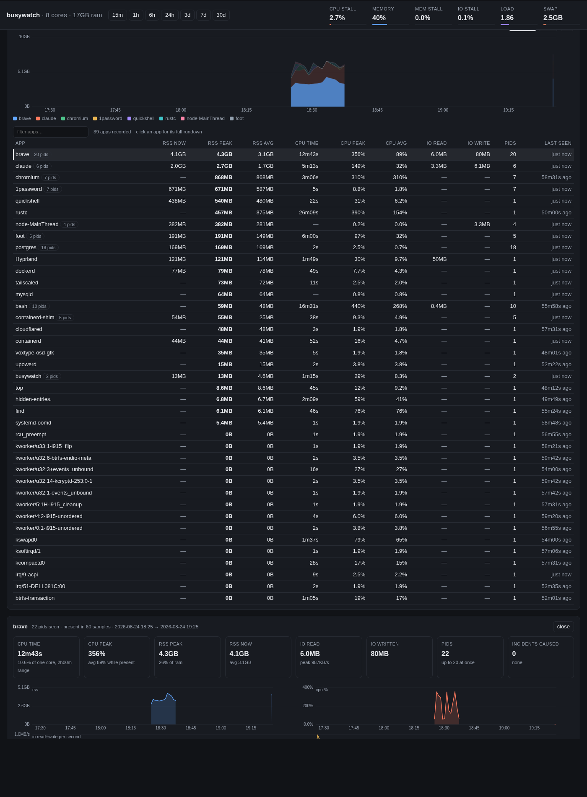

# busywatch

Warns when the system is too busy, at near-zero cost — and keeps a history of
what made it busy, browsable in a web UI.

Instead of polling, busywatch registers **PSI triggers** with the kernel
(`/proc/pressure/{cpu,memory,io}`) and sleeps in `poll()` until the kernel
itself reports that tasks were stalled beyond a threshold.

A trigger event alone is not a warning — compiles and page loads fire triggers
constantly. On each wakeup the sustained average (`avg60`) is checked, and only
when it exceeds the threshold for that resource does busywatch warn: a desktop
notification plus a log line naming the **top consumers** at that moment.

| resource | warns when |
|---|---|
| cpu | CPU `avg60` ≥ `--sustained` (20%) |
| memory | memory `avg60` ≥ `--mem-sustained` (10%) **or** MemAvailable < `--mem-free-pct` (10%) |
| io | IO `avg60` ≥ `--io-sustained` (25%) |

The memory rule catches a **mem-hog eating RAM before the kernel starts
stalling on it** — by the time memory pressure is high the machine is already
crawling.

A warning opens a **busy incident** for that resource: busywatch keeps
re-checking every `--poll-secs` until pressure falls below half the threshold,
then sends an **all-clear toast** ("Memory back to normal", with duration, peak
and culprit) that replaces the warning. Each resource has its own toast
identity, so a memory warning never silently erases a CPU one.

**Clicking either toast opens the history UI** as a chromeless overlay window
— no tabs, no address bar, just the page — on the resource that raised it and
a range wide enough to show the whole incident: a memory warning lands on the
memory hogs, a CPU one on the CPU hogs. With `--no-db` or no `--web`, the
click falls back to a detail snapshot in a floating terminal.

The overlay is a Chromium-family browser in `--app` mode, launched through
Omarchy's `omarchy-launch-webapp` when present and directly otherwise, with
`xdg-open` as the last resort. It is opened on a `busywatch.localhost` alias
rather than `127.0.0.1`: `--class` is X11-only, so on Wayland the window's
app_id comes from the URL's host, and the alias is what gives the overlay a
class of its own for a compositor rule to match. Any name under `.localhost`
resolves to loopback with no `/etc/hosts` entry. To float and size it under
Hyprland:

```lua
o.window({ class = "^.+busywatch\\.localhost.*-Default$" }, {
  float = true,
  center = true,
  size = { "(monitor_w*0.8)", "(monitor_h*0.8)" },
})
```

Match on the class, not the title: a Chromium app window is titled after its
URL until the page loads, and window rules are evaluated when the window maps.
The class carries the browser's own prefix — Brave maps the window as
`brave-busywatch.localhost__-Default` — which is what the leading `^.+` is
there for. Sizing it as a fraction of the monitor rather than in pixels keeps
it the same share of the screen on a laptop panel and an external display
both.

## Tray icon

busywatch registers a **StatusNotifierItem**, so it appears in any tray that
implements the spec — Waybar, quickshell, KDE, GNOME with an extension. The
icon is the current verdict: a quiet green dot while nothing is stalling, and
amber, red or blue while a CPU, memory or IO incident runs. Its tooltip
carries the live pressures and load, and clicking it opens the same overlay a
toast click does. `--no-tray` turns it off.

The D-Bus is hand-rolled — no bindings, no async runtime, the same way the web
server here is hand-rolled HTTP — so the dependency list stays `libc` and
`rusqlite` and the binary stays under 2 MB. No session bus or no tray host
means no icon and a log line, never a failure to start.

The click is delivered through Omarchy's `omarchy-notification-send --exec`
when that is installed (it carries the command as data, so a toast restored
after a shell restart is still clickable) and through a libnotify action
otherwise — mako, dunst and swaync all support it.

## History

busywatch records into an SQLite database at
`~/.local/state/busywatch/history.db` (override with `--db PATH`, disable with
`--no-db`):

* a **heartbeat sample every `--sample-secs`** (default 60 s) — all three
  pressures, load, memory and swap; **power** (mains online, battery percent,
  charge/discharge state and the signed watts flowing) and **clock** (mean and
  maximum CPU frequency, and the kernel's cumulative throttle counters); a row
  **per application** (every process
  summed by command name, so a browser's 20 renderers are one row); and rows
  for the individual processes behind the notable apps;
* the same sample every `--poll-secs` (default 10 s) **while an incident is
  running**, so the history is dense exactly where it matters;
* one row per incident: kind, start, end, peak pressure, minimum free memory
  and the culprit process.

Rows older than `--retain-days` (default 30) are pruned automatically, except
the bulky per-process rows, which go after `--retain-pid-days` (default 3) —
pid-level detail is a recent-forensics thing, the per-app rows are the long
record. A
heartbeat costs one `/proc` sweep per minute — a few milliseconds of CPU, which
is why the earlier "literally zero CPU while idle" is now "0.0x %". Set
`--sample-secs 0` to record only during incidents and get the old behaviour
back.

### On the command line

```sh
busywatch hogs                          # top memory hogs of the last 24h
busywatch hogs --by cpu --since 7d      # or by cpu / io, over any span
busywatch app brave --since 6h          # full rundown of one application
busywatch history 5                     # recent incidents with their culprits
busywatch detail                        # live snapshot + hogs + incidents
```

```
top 5 by mem over the last 24h00m (since 2026-08-23 18:17)

process                rss peak    rss avg    rss now   cpu pk  cpu avg     io peak  last seen
brave                     6.4GB      4.6GB      6.4GB      19%     2.2%     4.6MB/s  2026-08-24 18:17
firefox                   1.9GB      1.8GB      1.8GB     7.9%     1.0%          —  2026-08-24 18:17
claude                  967.7MB    923.9MB    882.7MB      10%     1.3%          —  2026-08-24 18:17
```

Figures are summed across the processes sharing a command name, so a browser's
hundred renderers count as one hog — and they are summed *before* the ranking,
so the total is the real total, not the sum of whichever processes happened to
make a top-N list. The raw per-sample rows stay in the db for ad-hoc `sqlite3`
queries.

`busywatch app NAME` is the whole story for one application:

```
brave — last 6h00m

  cpu time   43m07s     12.0% of one core   peak 356%   avg 87.6% while present
  rss        peak 5.0GB   avg 2.8GB   now 4.1GB   (30% of ram at peak)
  io         read 235.5MB   written 436.8MB   peak 1.4MB/s
  presence   103 samples   28 pid(s), up to 20 at once   18:25 → 19:19
  incidents  1 it was blamed for:
               2026-08-24 18:40 [cpu] 1m00s  peak 20%
```

### In a browser

```sh
busywatch web                    # http://127.0.0.1:8787
busywatch web --bind :9000
busywatch --web                  # or serve from the watcher itself
```



*(screenshot shows generated sample data)*


The page charts cpu / memory / io stall, load, memory used and swap over
**15 m to 30 d**, with recorded incidents shaded on the timeline, and a
**stacked chart of the top apps over time** (memory, CPU or IO). On a machine
that reports them there are three more: **cpu clock and battery percent**, with
throttled stretches shaded; **cpu temperature and fan speed**, drawn directly
under the clock because they are what those throttled stretches are made of;
and the **watts** flowing through the battery — draw and charge drawn apart,
so a laptop that suddenly runs the fan and the battery down at once shows both
in one glance. The temperature axis is fixed at 100 °C rather than scaled to
the range, so the height of the line means the same thing every time you look.

Time is not drawn to scale where nothing was recorded. A stretch with no
samples — asleep, powered off, or busywatch not running — **collapses to a
narrow seam** so the hours that were recorded get the width instead. Where the
chart is wide enough the seam is lettered with how long it swallowed ("8h"),
the legend says how many were collapsed and how long they were altogether, and
hovering one names the exact stretch. Only holes wider than the break that replaces
them are collapsed, so a brief suspend still reads as a gap in the line, and
every chart on the page shares the one axis — the crosshair still means a
single moment across all of them.

Below it is the **rundown**: every application seen in the range, filterable
and sortable on any column — rss now / peak / average, cpu time, cpu peak and
average, bytes read and written, how many pids, when it was last seen.

Clicking an app — in the rundown, the legend, or an incident's culprit —
opens its **drilldown**: what it added up to (cpu time and what share of a
core that is, peak and current RSS and what share of RAM, total IO), its RSS,
CPU and IO history over the range, every pid that carried it, and the
incidents it was blamed for. The view lives in the URL hash, so a reload comes
back where you were.

The server is dependency-free, read-only, and binds to loopback; the page
embeds everything it needs, so it works offline.

## Build & install

```sh
cargo build --release
install -m755 target/release/busywatch ~/.local/bin/busywatch
sudo setcap cap_sys_resource+ep ~/.local/bin/busywatch   # PSI triggers need this
systemctl --user enable --now busywatch.service          # unit in ./busywatch.service
```

The unit runs `busywatch --web`, so the history UI is always at
<http://127.0.0.1:8787/>; drop the flag from `ExecStart=` if you would rather
start it by hand.

The `setcap` must be repeated after every reinstall of the binary. Without the
capability (or without PSI), busywatch falls back to sampling the pressure
files every `--poll-secs` — a few small file reads, still negligible.

## Arch package

`packaging/` has a PKGBUILD that builds straight from this repository:

```sh
cd packaging
makepkg -si            # build, then install with pacman
```

It installs the binary to `/usr/bin`, a **user** unit to
`/usr/lib/systemd/user/busywatch.service`, and sets `cap_sys_resource` in a
post-install hook (capabilities live on the inode, so it re-applies on every
upgrade). Then:

```sh
systemctl --user enable --now busywatch.service
```

Note `options=('!lto')` in the PKGBUILD: makepkg enables LTO globally, and the
SQLite that rusqlite compiles from C would reach the Rust link step as bitcode
it cannot resolve. Rust-side LTO still happens — it is set in the release
profile in `Cargo.toml`.

To publish it on the AUR, push this PKGBUILD plus a generated `.SRCINFO`
(`makepkg --printsrcinfo > .SRCINFO`) to `ssh://aur@aur.archlinux.org/busywatch-git.git`.

## Options

| Flag | Default | Meaning |
|---|---|---|
| `--stall-ms` | 500 | trigger: stall time within the window |
| `--window-ms` | 1000 | trigger: window size |
| `--sustained` | 20 | warn when CPU avg60 ≥ this % |
| `--mem-sustained` | 10 | warn when memory avg60 ≥ this % |
| `--io-sustained` | 25 | warn when IO avg60 ≥ this % |
| `--mem-free-pct` | 10 | warn when MemAvailable drops below this % of RAM |
| `--cooldown` | 300 | seconds between repeat warnings, per resource |
| `--top` | 3 | processes named in the warning |
| `--poll-secs` | 10 | fallback sampling / busy re-check interval |
| `--sample-secs` | 60 | history heartbeat (0 = record only during incidents) |
| `--retain-days` | 30 | prune history older than this (0 = keep everything) |
| `--retain-pid-days` | 3 | keep the bulky per-process rows only this long |
| `--web [ADDR:]PORT` | off | serve the history UI while watching |
| `--no-notify` | | log only, no desktop notification |
| `--no-tray` | | no tray icon |
| `--db PATH` | `~/.local/state/busywatch/history.db` | history database |
| `--no-db` | | don't record history |

## Origin

Written after WirePlumber silently burned 2.5 CPU-hours digesting a stuck
Bluetooth discovery scan — a warning naming the hot process would have
surfaced that in minutes instead of hours. The history and the web UI came
next, for the slower version of the same problem: something that grows a
gigabyte an hour while you are not looking.
